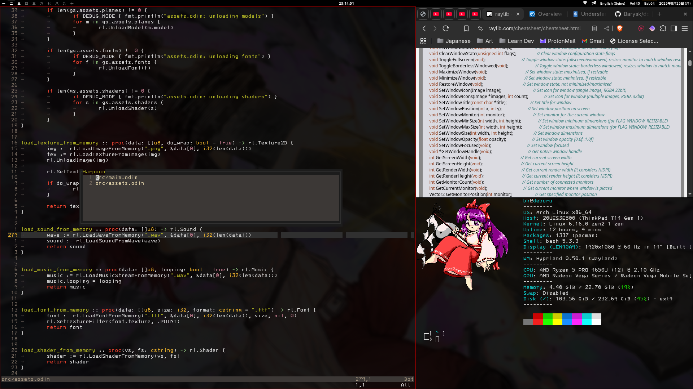

# Notes

* nwg-look: used for managing themes
* Theme things: papirus-icon-theme, materia-gtk-theme, kvantum
* chrome://flags in your chromium based browser set to wayland
* if electron application still flickers even after fixes provided in hyprland's guide, set a
  --disable-gpu flag, my case:

  Vesktop:

  Edit ```/usr/share/applications/vesktop.desktop```

  Add needed flag to Exec, like this ```Exec=vesktop --disable-gpu %U```
* if no Nvidia => remove Nvidia fixes from hyrland.conf

Here is an example how this "rice" looks


```
MASTER_LAYOUT_QUICK_GUIDE_______________________________________________________
This config uses master layout

+-----------------+--------+
|                 |        |
|                 |   S1   |
|                 |        |
|        M        +--------+
|                 |        |
|                 |   S2   |
|                 |        |
+-----------------+--------+

To increase/decrease number of master windows use:
SUPER+I / SUPER+D

To navigate the layout use:
SUPER+J to move down the stack
SUPER+K to move up

You can move window throught the stack
SUPER+J to move down
SUPER+K to move up

SUPER+H decreasing master area
SUPER+L increasing master area

SUPER+ALT+J resize window Y axis
SUPER+ALT+K resize window Y axis

SUPER+SHIFT+ENTER to swap windows

NAVIGATTION_____________________________________________________________________

Navigating throught the worksapces is basic:
SUPER+[workspace number 0..=9] // NOTE: 0 means 10th workspace

this going to move active window to a chosen workspace:
SUPER+SHIFT+[workspace number 0..=9]

this going to move active window and focus to a chosen workspace:
SUPER+ALT+[workspace number 0..=9]

there is a one special worksapce:
SUPER+S to open
SUPER+SHIFT+S to move something here

SUPER+TAB to "alt-tab" between workspaces

TURN_ON_FOCUS_HIGHLIGHT_________________________________________________________

SUPER+MINUS to turn heighlight off
SUPER+SHIFT+MINUS to heightligh on

MULTIMONITOR____________________________________________________________________

SUPER+period focuses r monitor
SUPER+comma focuses l moonitor

SUPER+SHIFT+period moves current worspace to right monitor
SUPER+SHIFT+comma moves current worspace to left monitor
SUPER+SHIFT+TAB swap VISIBLE WORKSPACES between monitors

BASICS__________________________________________________________________________

default apps:
terminal = kitty
file manager = pcmanfm
menu = tofi
lock = hyprlock
bar = waybar
browser = brave

Hide/Show bar:
SUPER+SHIFT+B

Activate blue light filter:
SUPER+SHIFT+N

Open terminal:
SUPER+enter

Kill active window:
SUPER+Q

Open file manager:
SUPER+E

Toggle fullscreen:
SUPER+F

Open application menu:
SUPER+P

Open telegram:
Super+T

Open browser:
Super+B

Screenshot:
SUPER+ALT+S

Lock screen:
SUPER+escape

Close hyprland session - exit to tty:
SUPER+SHIFT+escape

Toggle active window to floating mode:
SUPER+SHIFT+F

Anything else I either forgot or it hyprland's default, check hyprland.conf if unsure.

```
